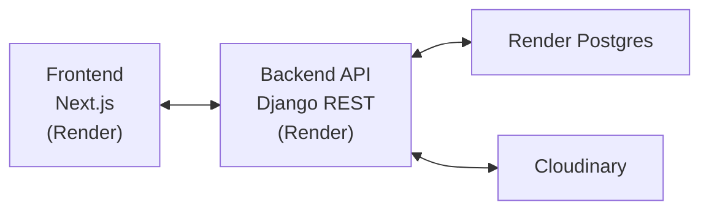
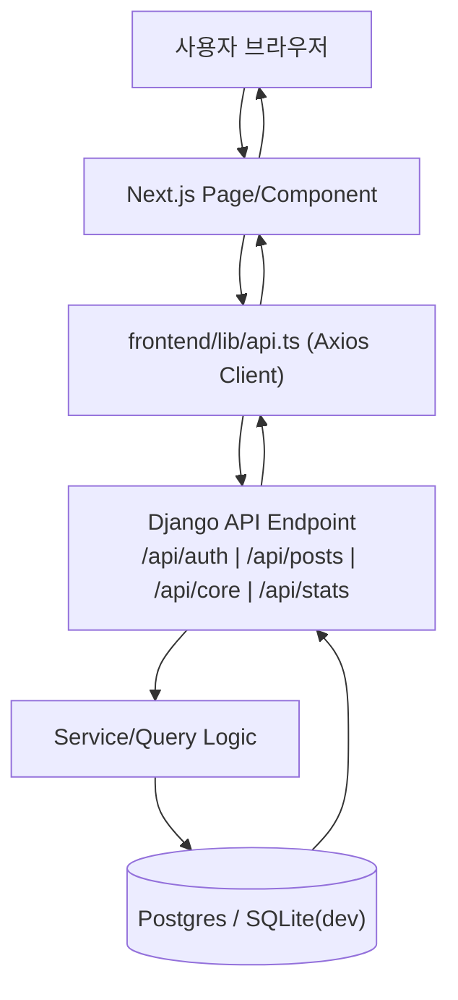
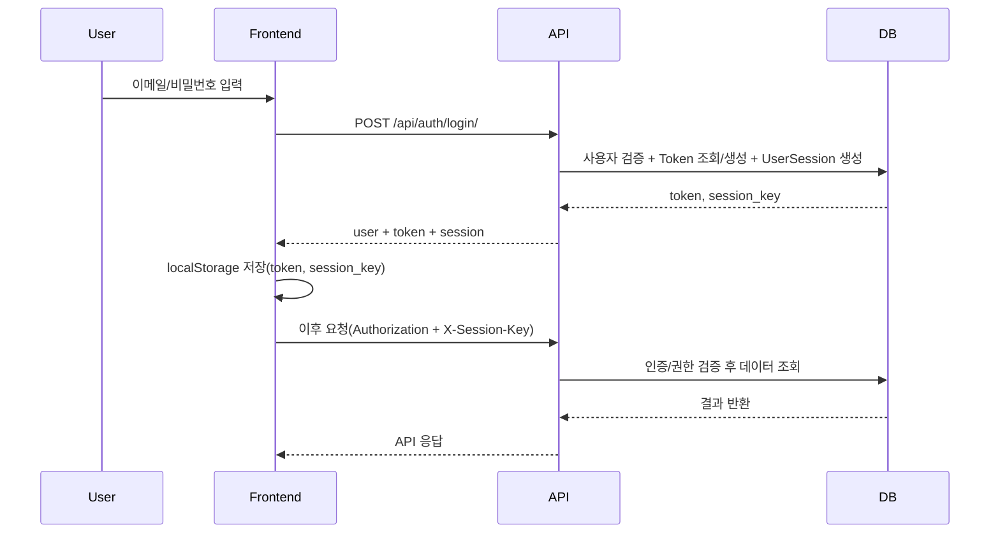
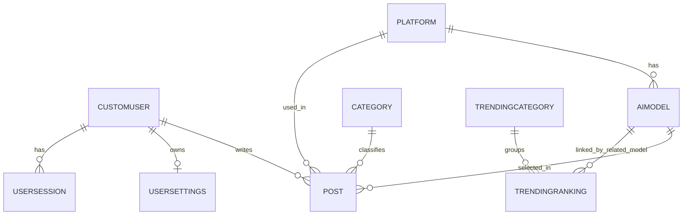

# PromptHub

AI 프롬프트/모델 사용 경험을 공유하는 커뮤니티 플랫폼입니다.  
백엔드는 Django REST API, 프론트엔드는 Next.js(App Router)로 구성되어 있습니다.

## Release Status

- 상태: **Production 배포 완료 (Render + Render Postgres + Cloudinary)**
- Frontend: `https://prompthub-frontend.onrender.com`
- Backend API: `https://prompthub-backend-06wq.onrender.com`
- Health Check: `https://prompthub-backend-06wq.onrender.com/api/core/health/`

### 배포 환경에서 확인 완료
- Backend health ✅
- Frontend live ✅
- Google 로그인 ✅
- 프로필 이미지 업로드 (Cloudinary) ✅
- 초기 카테고리/모델/트렌딩 데이터 로딩 ✅
- Django 관리자 페이지 접근 ✅

## 기술 스택

- Backend: Django 5.2, Django REST Framework, Token Auth
- Frontend: Next.js 15, React 18, TypeScript, Tailwind CSS, Radix UI
- Auth: Django Token Auth + NextAuth (Google OAuth)
- Infra: Render (Frontend, Backend, Postgres), Cloudinary (media)
- Dev Infra: Docker Compose (`backend` + `frontend`)

## 핵심 기능

- 회원가입/로그인/로그아웃, Google 로그인
- 프롬프트 게시글 CRUD
- 좋아요/북마크/내 게시글/좋아요한 게시글/북마크한 게시글
- 검색/정렬/필터
- 트렌딩 카테고리/랭킹 + 연관 게시글 조회
- 프로필/계정 설정/세션 관리
- 프로필 이미지 업로드 (Cloudinary 연동)

## 프로젝트 구조

```text
.
├── backend/
│   ├── config/                 # Django settings/urls
│   ├── users/                  # 인증/프로필/설정/세션
│   ├── posts/                  # 게시글/플랫폼/모델/카테고리
│   ├── core/                   # 검색/정렬/필터/트렌딩/헬스체크
│   ├── stats/                  # 대시보드/사용자 통계
│   ├── requirements.txt
│   └── manage.py
├── frontend/
│   ├── app/                    # Next.js App Router pages
│   ├── components/
│   ├── lib/
│   ├── hooks/
│   ├── types/
│   └── package.json
├── docs/
│   └── diagrams/
├── scripts/                    # 개발 스크립트
├── ROADMAP.md                  # 중장기 기능 로드맵
├── docker-compose.yml
└── package.json
```

## 아키텍처 다이어그램


SVG: `docs/diagrams/architecture.svg`

## 요청 처리 흐름


SVG: `docs/diagrams/request-flow.svg`

## 로그인/세션 흐름


SVG: `docs/diagrams/auth-session-flow.svg`

## 핵심 데이터 모델(ERD)


SVG: `docs/diagrams/core-erd.svg`

다이어그램 원본/산출물 위치:
- 원본: `docs/diagrams/*.mmd`
- 렌더 결과: `docs/diagrams/*.svg`, `docs/diagrams/*.png`

재생성:
```bash
for f in docs/diagrams/*.mmd; do
  b=${f%.mmd}
  npx -y @mermaid-js/mermaid-cli -i "$f" -o "$b.svg" -t default -b transparent
  npx -y @mermaid-js/mermaid-cli -i "$f" -o "$b.png" -t default -b transparent
done
```

## 요구 사항

- Python 3.11+ (배포는 Python `3.12.9` 고정)
- Node.js 18+ (Render에서는 Node 22 사용 가능)
- npm

## 로컬 실행

1. 의존성 설치

```bash
# repo root
cd prompthub2

# backend
python3 -m venv backend/venv
source backend/venv/bin/activate
pip install -r backend/requirements.txt

# frontend (repo root)
npm install
```

2. DB 마이그레이션

```bash
cd backend
source venv/bin/activate
python manage.py migrate
cd ..
```

3. 서버 실행

```bash
# 방법 1: 권장 스크립트
./scripts/start-dev.sh

# 방법 2: npm 스크립트
npm run dev
```

4. 접속

- Frontend: `http://localhost:3000`
- Backend API: `http://localhost:8000`
- Admin: `http://localhost:8000/admin/`
- Health Check: `http://localhost:8000/api/core/health/`

## 프로덕션 배포 구성 (정식 릴리즈)

### 구성
- `Render Web Service` (Backend / Django)
- `Render Web Service` (Frontend / Next.js)
- `Render Postgres`
- `Cloudinary` (프로필 이미지/미디어)

### Render Backend (권장 설정)
- Root Directory: `backend`
- Build Command:

```bash
pip install -r requirements.txt && python manage.py collectstatic --noinput && python manage.py migrate
```

- Start Command:

```bash
gunicorn config.wsgi:application --bind 0.0.0.0:$PORT
```

### Render Frontend (권장 설정)
- Root Directory: `frontend`
- Build Command:

```bash
npm ci && npm run build
```

- Start Command:

```bash
npm run start
```

## 환경 변수

### Frontend (`frontend/.env.local` / Render Frontend env)

로컬 예시:

```env
NEXT_PUBLIC_API_BASE_URL=http://localhost:8000
NEXT_INTERNAL_API_BASE_URL=http://localhost:8000
NEXT_PUBLIC_SITE_URL=http://localhost:3000

NEXTAUTH_URL=http://localhost:3000
NEXTAUTH_SECRET=replace-with-your-secret

NEXT_PUBLIC_GOOGLE_CLIENT_ID=your-google-client-id
GOOGLE_CLIENT_SECRET=your-google-client-secret
```

프로덕션(Render) 예시:

```env
NEXT_PUBLIC_API_BASE_URL=https://prompthub-backend-06wq.onrender.com
NEXT_INTERNAL_API_BASE_URL=https://prompthub-backend-06wq.onrender.com

NEXTAUTH_URL=https://prompthub-frontend.onrender.com
NEXTAUTH_SECRET=replace-with-your-secret

NEXT_PUBLIC_GOOGLE_CLIENT_ID=your-google-client-id
GOOGLE_CLIENT_SECRET=your-google-client-secret
```

### Backend (Render Backend env)

```env
DJANGO_SETTINGS_MODULE=config.settings_prod
SECRET_KEY=replace-with-your-secret
DJANGO_SECRET_KEY=replace-with-your-secret
DEBUG=False
DJANGO_DEBUG=False
DJANGO_ALLOWED_HOSTS=prompthub-backend-06wq.onrender.com

DATABASE_URL=postgresql://... # Render Postgres Internal Database URL

CORS_ALLOWED_ORIGINS=https://prompthub-frontend.onrender.com
CSRF_TRUSTED_ORIGINS=https://prompthub-frontend.onrender.com

PYTHONUNBUFFERED=1
PYTHON_VERSION=3.12.9

# Google OAuth (backend verification용)
GOOGLE_CLIENT_ID=your-google-client-id

# Cloudinary
CLOUDINARY_CLOUD_NAME=your-cloud-name
CLOUDINARY_API_KEY=your-cloudinary-api-key
CLOUDINARY_API_SECRET=your-cloudinary-api-secret
```

참고:
- `backend/.env.example`, `frontend/.env.example`에 배포용 키 예시가 정리되어 있습니다.

## 프로덕션 DB 초기 데이터 로딩 (1회)

배포 직후 Render Postgres는 비어 있으므로 아래 커맨드를 실행해야 커뮤니티/트렌딩 데이터가 표시됩니다.

### 권장 방식 (로컬에서 Render Postgres External URL로 연결)

```bash
cd backend
source venv/bin/activate

export DJANGO_SETTINGS_MODULE=config.settings_prod
export DATABASE_URL='postgresql://<user>:<password>@<host>.singapore-postgres.render.com/<dbname>?sslmode=require'
export SECRET_KEY='temporary-local-command-key'
export DJANGO_SECRET_KEY="$SECRET_KEY"
export DJANGO_ALLOWED_HOSTS='prompthub-backend-06wq.onrender.com'
export CORS_ALLOWED_ORIGINS='https://prompthub-frontend.onrender.com'
export CSRF_TRUSTED_ORIGINS='https://prompthub-frontend.onrender.com'
export DJANGO_DEBUG='False'
```

실행 순서:

```bash
venv/bin/python manage.py load_categories
venv/bin/python manage.py load_ai_models --file posts/fixtures/platform_models.curated.json
venv/bin/python manage.py load_trending_data
venv/bin/python manage.py link_trending_models
```

선택(더미 유저/샘플 데이터):

```bash
# 더미 유저 10명 (데이터 마이그레이션 적용)
venv/bin/python manage.py migrate users

# 샘플 게시글 생성 (관리자 제외, 최대 10명 사용자 라운드로빈)
venv/bin/python manage.py generate_sample_posts --count 10
```

## 주요 페이지

- `/home`
- `/community`
- `/trending`
- `/bookmarks`
- `/profile`
- `/profile/settings`
- `/post/[id]`
- `/edit-post/[id]`
- `/extension`

## API 라우트 요약

- Auth: `/api/auth/...`
- Posts: `/api/posts/...`
- Core: `/api/core/...`
- Stats: `/api/stats/...`

## 자주 쓰는 명령어

- `./scripts/start-dev.sh`: 백엔드 + 프론트 동시 실행
- `./scripts/check-servers.sh`: 3000/8000 상태 확인
- `./scripts/clean-ports.sh`: 포트 점유 프로세스 정리
- `./scripts/migrate.sh`: `makemigrations` + `migrate`
- `cd frontend && npm run lint`: 프론트 린트
- `cd frontend && npm run typecheck`: 타입 체크
- `cd frontend && npm run build`: 프론트 프로덕션 빌드
- `cd backend && python manage.py test`: 백엔드 테스트

## Docker (개발용)

```bash
docker compose up --build
```

기본 포트:
- Frontend `3000`
- Backend `8000`

## 운영 메모 / 보안 체크리스트

- [ ] Render Postgres 비밀번호 rotate (대화/스크린샷 노출 이력)
- [ ] Google OAuth Client Secret rotate (노출 이력)
- [ ] Cloudinary API Secret 외부 공유 금지
- [ ] 프로덕션 콘솔 로그/민감정보 노출 점검
- [ ] `ROADMAP.md` 우선순위 기반 후속 기능 진행

## 참고

- 로드맵: `ROADMAP.md`
- 일부 구형 스크립트/문서는 과거 경로를 참조할 수 있으므로 최신 배포 절차는 본 README 기준으로 진행하세요.
