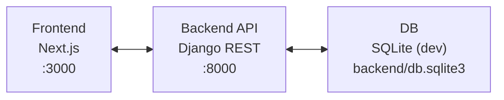
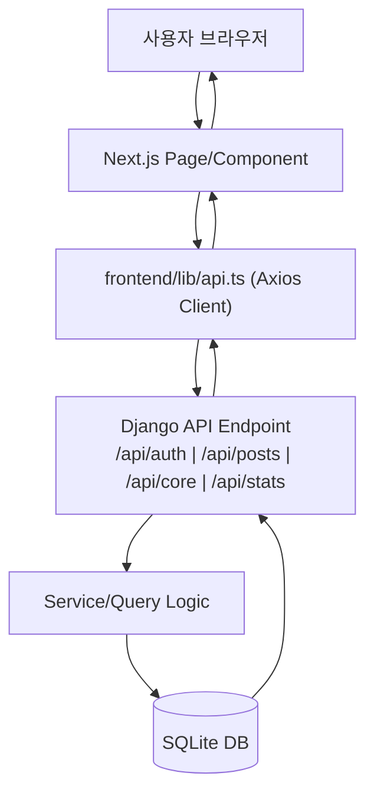
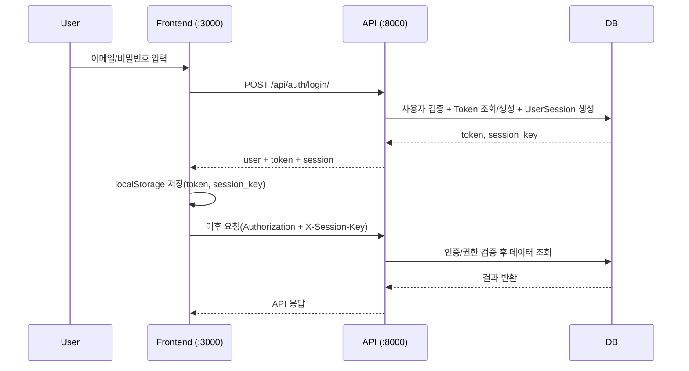
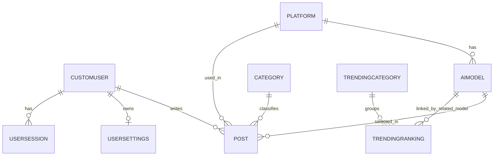

# PromptHub

프롬프트/모델 사용 경험을 공유하는 커뮤니티 플랫폼입니다.  
백엔드는 Django REST API, 프론트엔드는 Next.js(App Router)로 구성되어 있습니다.

## 기술 스택

- Backend: Django 5.2, Django REST Framework, Token Auth
- Frontend: Next.js 15, React 18, TypeScript, Tailwind CSS, Radix UI
- Infra: Docker Compose (`backend` + `frontend`)

## 핵심 기능

- 회원가입/로그인/로그아웃, Google 로그인
- 프롬프트 게시글 CRUD
- 좋아요/북마크/내 게시글/좋아요한 게시글/북마크한 게시글
- 검색/정렬/필터
- 트렌딩 카테고리/랭킹 + 연관 게시글 조회
- 프로필/계정 설정/세션 관리

## 프로젝트 구조

```text
.
├── backend/
│   ├── config/                 # Django settings/urls
│   ├── users/                  # 인증/프로필/설정/세션
│   ├── posts/                  # 게시글/플랫폼/모델/카테고리
│   ├── core/                   # 검색/정렬/필터/트렌딩/헬스체크
│   ├── stats/                  # 대시보드/사용자 통계
│   ├── requirements.txt
│   └── manage.py
├── frontend/
│   ├── app/                    # Next.js App Router pages
│   ├── components/
│   ├── lib/
│   ├── hooks/
│   ├── types/
│   └── package.json
├── scripts/                    # 개발 스크립트
├── docker-compose.yml
└── package.json
```

## 아키텍처 다이어그램


SVG: `docs/diagrams/architecture.svg`

## 요청 처리 흐름


SVG: `docs/diagrams/request-flow.svg`

## 로그인/세션 흐름


SVG: `docs/diagrams/auth-session-flow.svg`

## 핵심 데이터 모델(ERD)


SVG: `docs/diagrams/core-erd.svg`

다이어그램 원본/산출물 위치:
- 원본: `docs/diagrams/*.mmd`
- 렌더 결과: `docs/diagrams/*.svg`, `docs/diagrams/*.png`

재생성:
```bash
for f in docs/diagrams/*.mmd; do
  b=${f%.mmd}
  npx -y @mermaid-js/mermaid-cli -i "$f" -o "$b.svg" -t default -b transparent
  npx -y @mermaid-js/mermaid-cli -i "$f" -o "$b.png" -t default -b transparent
done
```

## 요구 사항

- Python 3.11+
- Node.js 18+
- npm

## 로컬 실행

1. 의존성 설치

```bash
# repo root
cd prompthub2

# backend
python3 -m venv backend/venv
source backend/venv/bin/activate
pip install -r backend/requirements.txt

# frontend (root workspace 기준)
npm install
```

2. DB 마이그레이션

```bash
cd backend
source venv/bin/activate
python manage.py migrate
cd ..
```

3. 서버 실행

```bash
# 방법 1: 권장 스크립트
./scripts/start-dev.sh

# 방법 2: npm 스크립트
npm run dev
```

4. 접속

- Frontend: `http://localhost:3000`
- Backend API: `http://localhost:8000`
- Admin: `http://localhost:8000/admin/`
- Health Check: `http://localhost:8000/api/core/health/`

## 주요 페이지

- `/home`
- `/community`
- `/trending`
- `/bookmarks`
- `/profile`
- `/profile/settings`
- `/post/[id]`
- `/edit-post/[id]`
- `/extension`

## API 라우트 요약

- Auth: `/api/auth/...`
- Posts: `/api/posts/...`
- Core: `/api/core/...`
- Stats: `/api/stats/...`

## 환경 변수

### Frontend (`frontend/.env.local`)

```env
NEXT_PUBLIC_API_BASE_URL=http://localhost:8000
NEXT_PUBLIC_SITE_URL=http://localhost:3000

NEXTAUTH_URL=http://localhost:3000
NEXTAUTH_SECRET=replace-with-your-secret

NEXT_PUBLIC_GOOGLE_CLIENT_ID=your-google-client-id
GOOGLE_CLIENT_SECRET=your-google-client-secret
```

### Backend (옵션, 미설정 시 기본값 사용)

`backend/config/settings_base.py`에서 아래 키를 읽습니다.

```env
DJANGO_SECRET_KEY=change-me
DJANGO_DEBUG=true
DJANGO_ALLOWED_HOSTS=localhost,127.0.0.1
CORS_ALLOWED_ORIGINS=http://localhost:3000,http://127.0.0.1:3000
CSRF_TRUSTED_ORIGINS=http://localhost:3000,http://127.0.0.1:3000
GOOGLE_CLIENT_ID=your-google-client-id
```

## 자주 쓰는 명령어

- `./scripts/start-dev.sh`: 백엔드 + 프론트 동시 실행
- `./scripts/check-servers.sh`: 3000/8000 상태 확인
- `./scripts/clean-ports.sh`: 포트 점유 프로세스 정리
- `./scripts/migrate.sh`: `makemigrations` + `migrate`
- `npm run lint`: 프론트 린트
- `cd frontend && npm run typecheck`: 타입 체크
- `cd backend && python manage.py test`: 백엔드 테스트

## Docker

```bash
docker compose up --build
```

기본 포트:
- Frontend `3000`
- Backend `8000`

## 참고

- 현재 저장소의 일부 자동화 스크립트는 과거 경로/커맨드를 참조할 수 있습니다.  
  (`scripts/start-dev.sh`, `scripts/migrate.sh`, `scripts/check-servers.sh`, `scripts/clean-ports.sh`) 중심으로 사용하는 것을 권장합니다.
